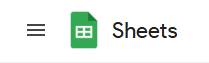
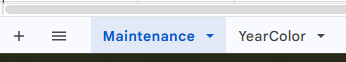
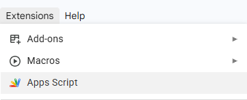
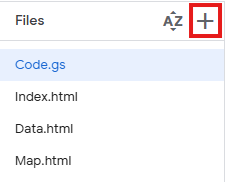
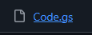
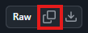
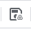
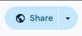
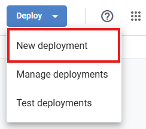
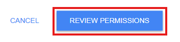

# Highway Maintenance Mapper (DOH Mapper)

DOH Mapper is a web-application built on **Google Apps Script (GAS)**, designed for the Department of Highways (DOH) to map, visualize, and manage highway maintenance tasks.

It uses a Google Spreadsheet as the database to store task assignments, coordinates, budgets, and maintenance statuses. The frontend incorporates Leaflet.js to render interactive road maps, actively fetching actual highway vector data and milestone coordinates to draw precise curves matching the real world.

## 🚀 Features

- **Interactive Map Visualization**: Automatically traces the exact highway route on a Leaflet map from Start/End milestones.
- **Data Management Table**: A mobile-responsive table view to Add, Edit, and Delete maintenance tasks.
- **Access Control**: Built-in permission system allowing for Public, Organization-wide, or strict Whitelist edit access.
- **Account Switcher**: Solves the notorious Google Apps Script "Multiple Accounts Signed In" issue without requiring users to open Incognito tabs.

## 🛠️ How to Deploy

Follow these steps to deploy this application to your own Google Drive.

### 1. Prepare the Database (Google Sheet)
1. Go to [docs.google.com](https://www.docs.google.com/spreadsheets)
2. Make sure to login with your admin account.
3. Create a new Google Spreadsheet.<br/>
4. Create three sheets exactly named:<br/>
   - `Maintenance`
   - `YearColor`
   - `CustomMarker`
5. In the `Maintenance` sheet, set up the following headers in Row 1:
   `Task_Code`, `Year`, `Highway_Number`, `Milestone_Start_Lat`, `Milestone_Start_Lng`, `Milestone_End_Lat`, `Milestone_End_Lng`, `Distance`, `Cost`, `Guarantee_Start`, `Guarantee_End`, `Add_Date`, `Adder`
   <br/>**Or can copy this and paste it into the first row of the sheet**
   <sub>

   ```text
   Task_Code	Year	Highway_Number	Milestone_Start_Lat	Milestone_Start_Lng	Milestone_End_Lat	Milestone_End_Lng	Distance	Cost	Guarantee_Start	Guarantee_End	Add_Date	Adder
   ```
   
   </sub>
   
6. In the `YearColor` sheet, set up the following headers in Row 1:
   `Year`, `Color`
   <br/>**Or can copy this and paste it into the first row of the sheet**
   <sub>

   ```text
   Year	Color
   ```
   
   </sub>

7. In the `CustomMarker` sheet, set up the following headers in Row 1:
   `Label`, `Mark`, `Location_Lat`, `Location_Lng`
   <br/>**Or can copy this and paste it into the first row of the sheet**
   <sub>

   ```text
   Label	Mark	Location_Lat	Location_Lng
   ```
   
   </sub>

### 2. Add the Code
1. From your Google Sheet, click **Extensions > Apps Script**.<br/>
2. Create the following 4 files in the script editor by pressing add and copy the code from this repository into them:<br/>
   - `Code.gs` (Script)
   - `Index.html` (HTML)
   - `Data.html` (HTML)
   - `Map.html` (HTML)
   - `Marker.html` (HTML)
   > [!TIP]
   > Open by click file name of code file in this repository  then Select all and copy or press copy button 

3. Save the project **(Ctrl+s)** or   .

### 3. Configure Access Control (Google Sheet Sharing)
The "Edit Data" (แก้ไขข้อมูล) tab is always visible in the app. However, **actual edit access is strictly controlled by your Google Spreadsheet sharing settings.**

1. Open your Google Spreadsheet (`Maintenance` database).
2. Click the **Share** button in the top right corner.<br/>
3. To limit who can edit the map data:
   - Make sure **General access** is set to **Restricted** or **Viewer**.
   - Explicitly add the email addresses of the staff members who need to edit the data and set their role to **Editor**.

> [!NOTE]
> If a Viewer tries to save or delete data in the app, Google will automatically block them and show a "Permission Denied" error popup.

<br/>

| Permission | Access in Web Application |
| :--- | :--- |
| Email who's Editor | Add, Edit, Delete |
| Email who's Viewer | View |

<br/>

### 4. Deploy as a Web App
1. In the Apps Script editor, click the **Deploy** button in the top right, then **New deployment**.<br/>
2. Select type **Web app**.<br/>
3. **Configuration Options:**
   - **Execute as:** You **must** select **"User accessing the web app"** (Execute as User). *This is required so the script knows who is logging in.*
   - **Who has access:** This dropdown controls who can open the URL. 
     - **Option A (Public View / Restricted Edit):** Choose **"Anyone with Google Account"**. Everyone can view the map, but only "Editors" from Step 3 can actually edit data.
     - **Option B (Organization Only):** Choose **"Anyone within [Your Organization]"**. Only internal staff can open the link.
4. Click **Deploy** and authorize the permissions when prompted.
5. Copy the generated Web App URL.

> [!IMPORTANT]
> API to get highway vector data and milestone coordinate is from Thailand's Department of Highways Database, If you want to use this application for other country, you need to replace the API with your country's API.

---

## ⚠️ Troubleshooting Google Account Errors

### The "Multiple Accounts / Unable to Open File" Error
If a user is logged into multiple Google Accounts on their browser (e.g., a personal Gmail and a work email), Google Apps Script often gets confused and forces an error page or a 401 Unauthorized redirect.

**Solution:**
This application includes a built-in **"เปลี่ยนบัญชี" (Switch Account)** button in the top navigation bar. 
If users encounter access issues or infinite login loops on Desktop or Mobile Chrome:
1. They should click the "เปลี่ยนบัญชี" button.
2. They will be taken to Google's native Account Chooser screen.
3. They must select the email address that has permission to view the app.
4. The system will automatically redirect them back to the working application.

> [!NOTE]
> Users no longer need to use Incognito Mode to bypass this limitation.

### Review Permission to Access at first time access
If you see page need to review permission to access, click **Review permission** button and follow the steps to review permission to access. then If it say "NOT save to proceed" click **Advanced** button and click **Go to <spreadsheet_name> (unsafe)** button.<br/>

---

## 📁 Documents & Assets

You can download the instruction manual and reference materials here:
- [Download User Manual - TH](./assets/manual_th.pdf) 
- [Download User Manual - EN](./assets/manual_en.pdf) 

---
*Created by [KATANA0x00](https://github.com/KATANA0x00)<br/>Powered by Department of Highways, Phetchabun (DOH)<br/>Built using Google Services*